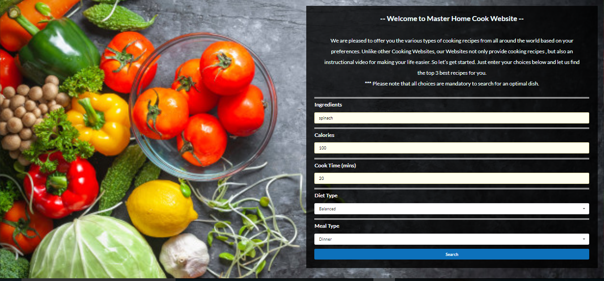

# GroupProject1

# Title: Master Home Cook
```

User Story:

```
### As a diet conscious user,

I want to be able to get recipe information and video for an ingredient that am intrested in.

So that I can be aware of the calories and cooking methodology for that ingredient.

### Acceptance criteria:

I should have an option to enter any ingredient in the ingredients input section.
I should also be able to select the diet type, meal type from the respective menus.
I am provided with at least three choices of videos for the recipes along with calories and cooking time(in minutes) information.
When I select one of the video choice it should play the you tube video.
```

Team Members:

```
Member 1: Max Guo, Maxguojiaqi, https://github.com/Maxguojiaqi
Member 2: Josh Babu George, joshb4u, https://github.com/joshb4u/
Member 3: Sujatha Mallela, sujatha-m, https://github.com/sujatha-m/
```

High Level Description:

```
## Server-Side APIs: Master Home Cook

### Motivation
Wondering how to get the right blend of ingredients that make up a nutritious and balanced diet for a calorie conscious you? Meet Master Home Cook!

### Overview 
An application that displays Master Home Cook welcome page with multiple options like ingredients,calories,cook time,diet type and meal type for the user to enter. The results are obtained by making calls to ThirdParty APIs to fetch and process the received data.

Master Home Cook suggests top 3 recipes based on user input preference.Then,depending on the recipe selected, Master Home Cook plays the youtube video. 

### Technologies Used
* Materialize CSS
* Semantic UI
* CSS
* HTML
* JavaScript
* jQuery
* AJAX
* YouTube API
* Edamam API
* GitHub

### INSTRUCTIONS:
Enter the ingredients, calories,cook time, diet type and meal type and then click on search button.
User will be provided top three recipes with cooking instructions. 

User can choose one of the option to watch a video of that particular receipe.
user could also select other recipe choices to see corresponding video playback option.

Once done with video, user can refresh the page to go back to homepage.

### Functionality
The application has been designed based on the following criteria:-

When the user enters Ingredients, calories, cook time, diet type and meal type in the input form and clicks on the search button, the backend javascript function uses the ingredient to make a request to Edamam API to fetch the data consisting of ingredients, diet type, and meal type.

It also makes a request to Edamam API & You tube API to fetch the  data consisting of user

User has to enter all choices are mandatory to search for an optimal dish.
```

Two APIs

```
Edamam API: https://developer.edamam.com/
Youtube Search API: https://developers.google.com/youtube/v3/
```

Front End Framework:
```
Semantic UI: https://semantic-ui.com/
```
 
BasicWireFrame


```

The following images demonstrate the application functionality:





```